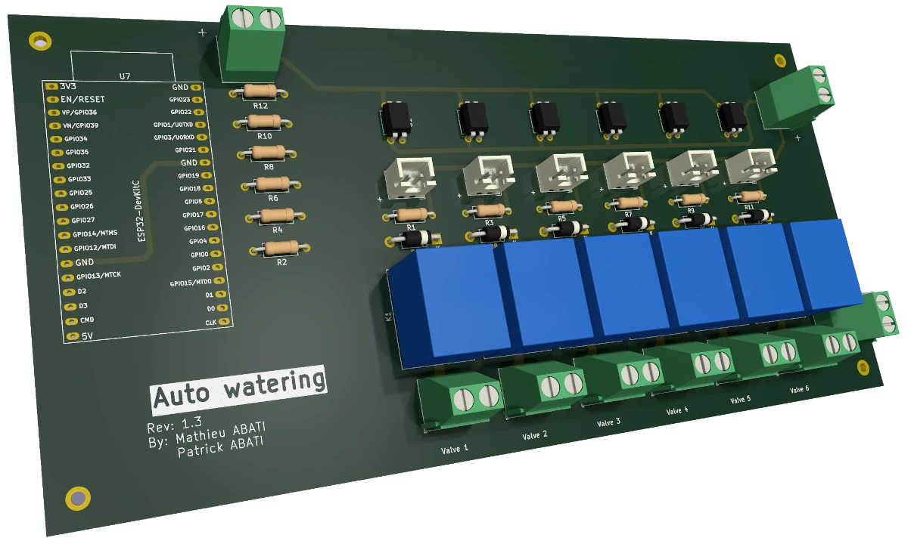
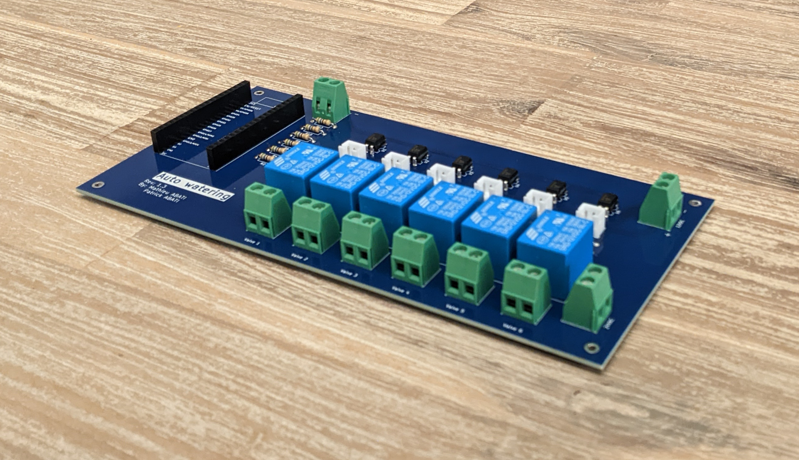
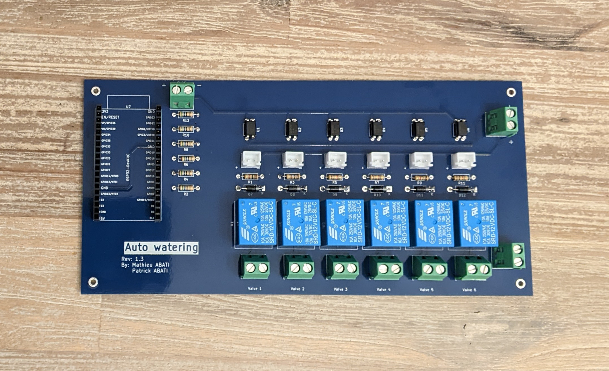
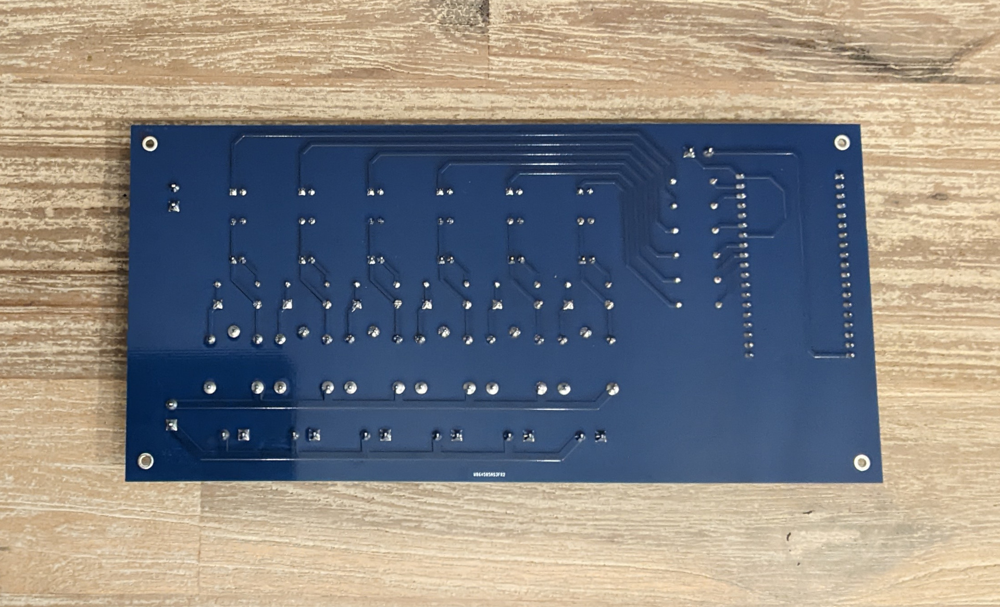
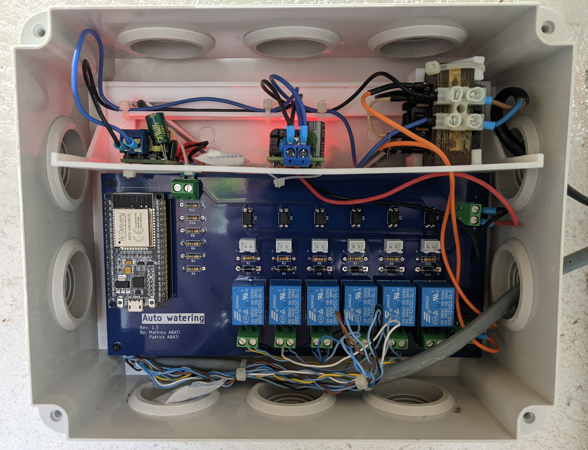

# Auto Watering PCB

KiCad project for auto watering PCB.
This PCB is designed for up to 6 valves.

This KiCad project requires Espressif KiCad Library.

You can find a firmware designed to run on this board [on the dedicated repository](https://github.com/auto-watering/firmware).

## Required parts

- ESP32 DevKit C
- Support for ESP32 board
- For each valve:
  - SRD12VDC relay
  - PC817 C photocoupler
  - LED
  - JST connector 1x02 2.50mm pitch (for case mounted LED)
  - 1 kOhm resistor
  - 56 Ohm resistor
  - flyback diode
  - TerminalBlock Phoenix MKDS-1,5/2 1x02 5mm pitch (for valve)
  - Valves themselves (for example RainBird HV series, 24VAC)
- 5V DC power supply for ESP32
- 12V DC power supply for relays command
- Power supply for valves (24VAC for RainBird HV series)
- 3x TerminalBlock Phoenix MKDS-1,5/2 1x02 5mm pitch (for power supplies)

## Prototyping

Thanks to [PCBWay](https://www.pcbway.com) for helping prototyping this project
by sending me assembled boards !
The build quality is great, and their manufacturing service was very available
and professional to help me to prepare everything and create the bill of
material (BOM).

Below are some pictures of these prototypes boards.

You can find in the project releases all [PCBWay](https://www.pcbway.com)
related resources to make it (gerbers, positions, BOM).

It is perfectly working, installed in a waterproof case, with power supplies
for 5VDC, 12VDC, 24VAC, and the ESP32 with the
[firmware](https://github.com/auto-watering/firmware).

## Improvements

As EL817(D)-G optocoupler should be OK to control the relay coil, it may be
appropriate to use a MOFSET between them.
